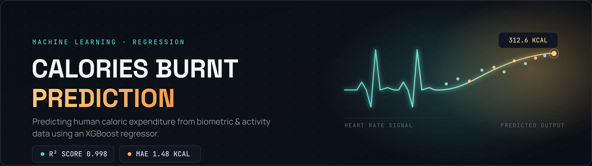
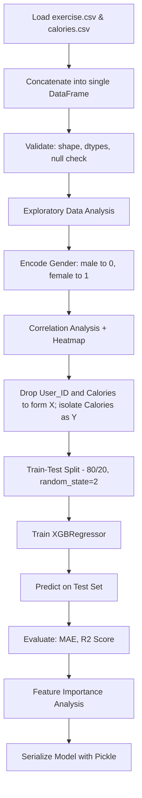
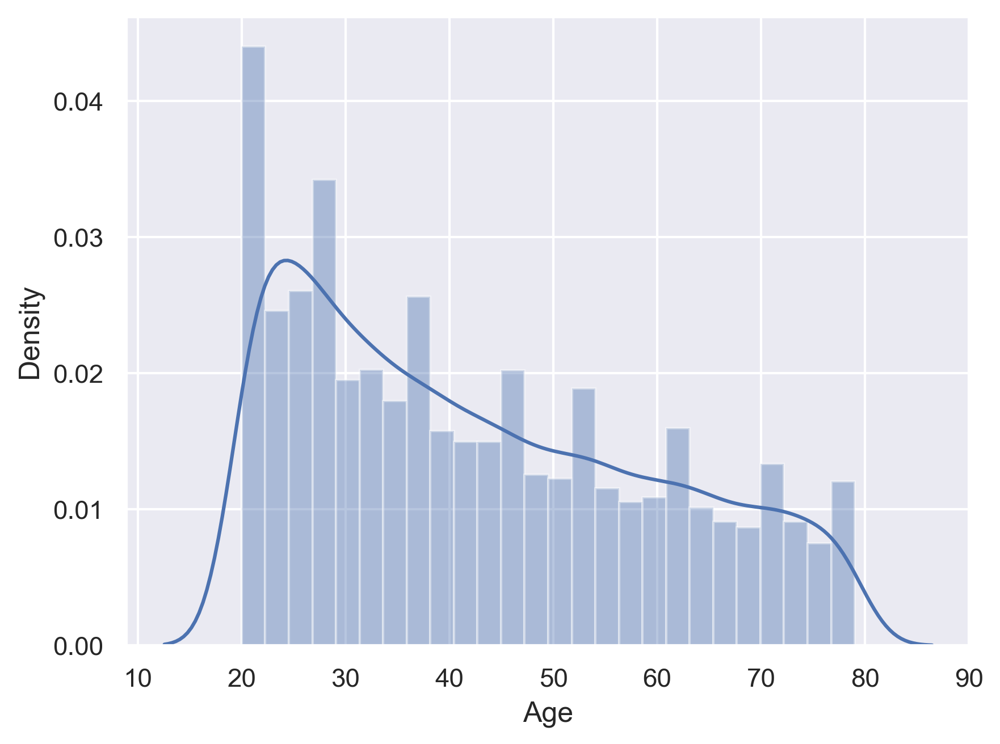
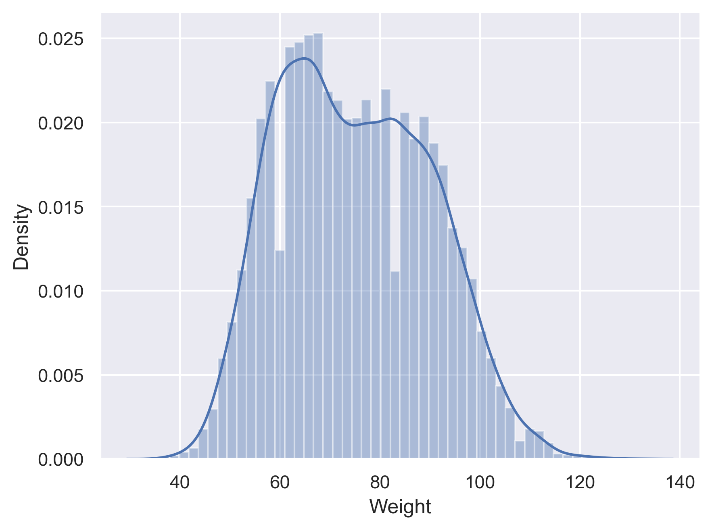
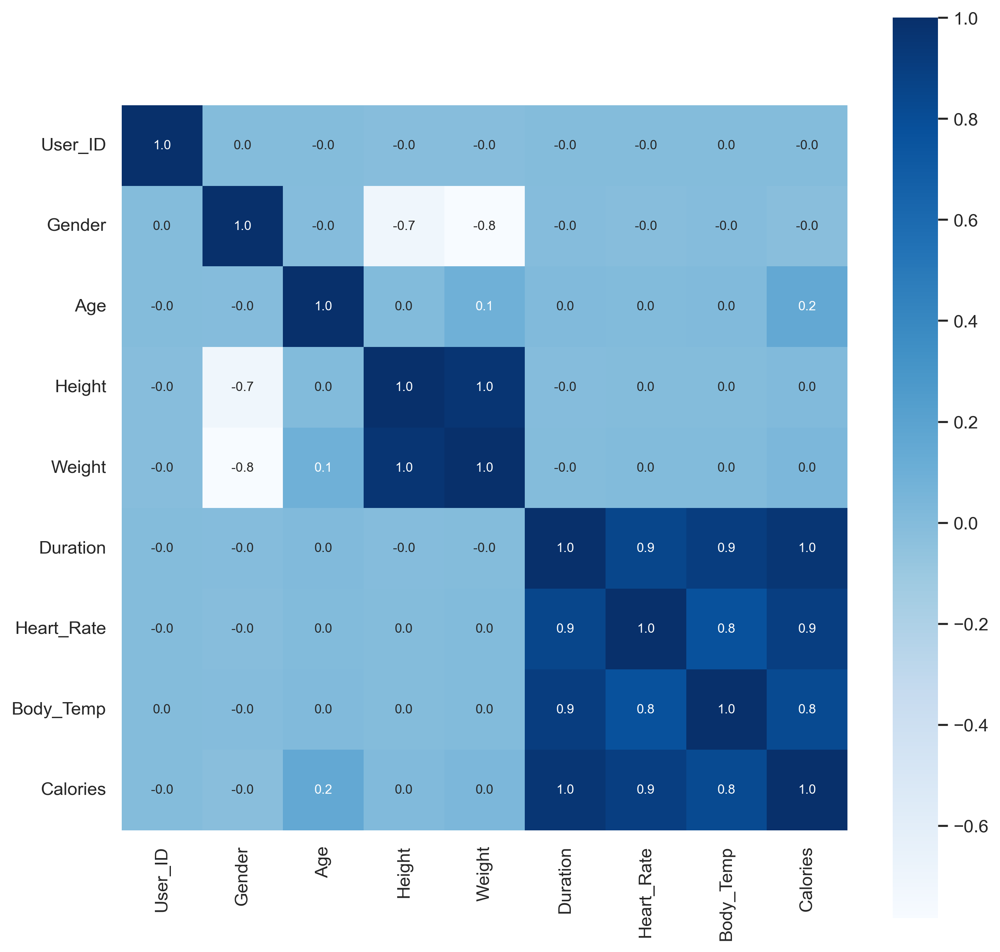
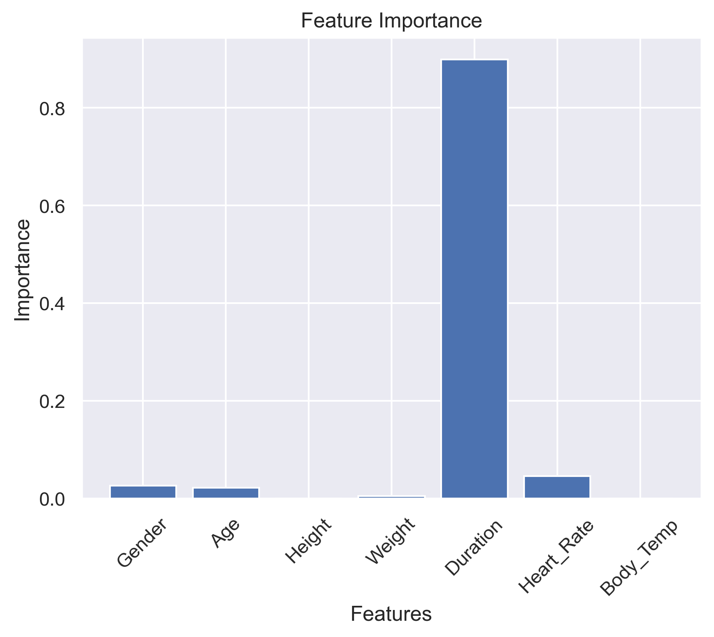
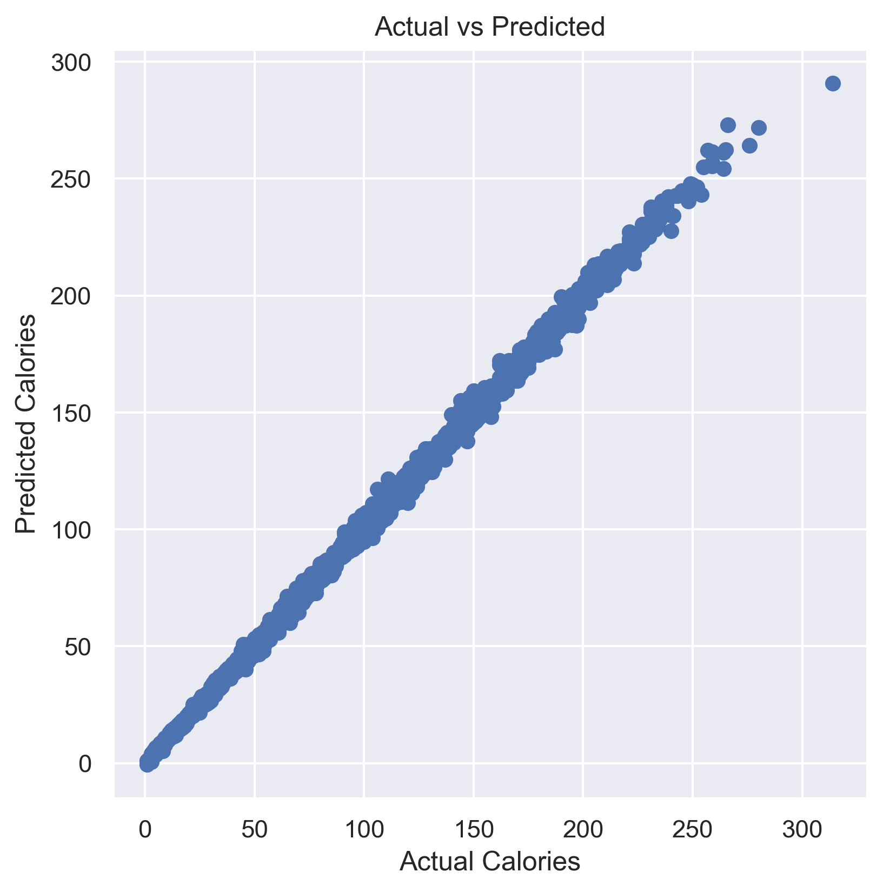

<div align="center">

# Calories Burnt Prediction

### Predicting Human Caloric Expenditure from Biometric & Activity Data using XGBoost



<br/>

[](https://www.python.org/)
[](https://xgboost.readthedocs.io/)
[](https://scikit-learn.org/)
[](https://pandas.pydata.org/)
[](https://numpy.org/)
[](https://jupyter.org/)
[](LICENSE)

*R² of 0.998 and Mean Absolute Error of 1.48 kcal on held-out test data.*

</div>

<br/>

---

## Table of Contents

- [Overview](#overview)
- [Business Problem](#business-problem)
- [Key Highlights](#key-highlights)
- [Dataset](#dataset)
- [Technology Stack](#technology-stack)
- [Repository Structure](#repository-structure)
- [Installation](#installation)
- [Usage](#usage)
- [Machine Learning Pipeline](#machine-learning-pipeline)
- [Model Architecture](#model-architecture)
- [Model Performance](#model-performance)
- [Feature Importance](#feature-importance)
- [Sample Prediction](#sample-prediction)
- [Visualizations](#visualizations)
- [Known Limitations & Engineering Notes](#known-limitations--engineering-notes)
- [Future Improvements](#future-improvements)
- [Learning Outcomes](#learning-outcomes)
- [FAQ](#faq)
- [Contributing](#contributing)
- [License](#license)
- [Author](#author)

<br/>

---

## Overview

This project trains an **XGBoost Regressor** to estimate calories burned during physical exercise from seven biometric and activity features: gender, age, height, weight, exercise duration, heart rate, and body temperature.

The notebook walks through the full applied ML workflow — merging two raw data sources, validating data quality, exploring feature distributions and correlations, encoding categorical data, training a gradient-boosted tree model, and evaluating it with standard regression metrics — before packaging the trained model with `pickle` for reuse.

On a held-out test split of 3,000 records, the model achieves an **R² of 0.9988** and a **Mean Absolute Error of 1.48 kcal**, meaning predictions are, on average, within roughly a calorie and a half of the true value.

<br/>

---

## Business Problem

Manually estimating calories burned during exercise is unreliable — it varies by metabolism, body composition, and exertion level, and most consumer fitness devices rely on rough heuristics rather than personalized models.

A learned regression model that maps easily-collected biometric signals to calorie expenditure has direct value in:

| Domain | Application |
|---|---|
| Wearables & Fitness Apps | Real-time calorie estimates from heart rate and activity sensors |
| Health & Wellness Platforms | Personalized exercise recommendations based on predicted burn rate |
| Telehealth | Objective activity tracking to support remote patient monitoring |
| Personal Training | Data-backed intensity planning per client |

<br/>

---

## Key Highlights

- **High predictive accuracy** — R² of 0.998 against actual calorie values on unseen data
- **Low error margin** — MAE of ~1.48 kcal, tight enough for practical fitness applications
- **Reasoned model selection** — the notebook documents why XGBoost was chosen over Linear Regression and Random Forest for this problem, rather than defaulting to it
- **Full EDA coverage** — distribution plots, KDE plots, and a correlation heatmap precede modeling
- **Deployable artifact** — the trained model is serialized with `pickle` and ready to be wrapped in an API or app
- **Interactive prediction cell** — a CLI-style input flow lets a user enter their own biometric values and get a live calorie estimate

<br/>

---

## Dataset

Two source files are combined into a single working dataset:

| File | Contents | Rows |
|---|---|---|
| `exercise.csv` | `User_ID`, `Gender`, `Age`, `Height`, `Weight`, `Duration`, `Heart_Rate`, `Body_Temp` | 15,000 |
| `calories.csv` | `User_ID`, `Calories` | 15,000 |

The two files are combined with `pd.concat([exercise_data, calories['Calories']], axis=1)` — a **positional** concatenation rather than a key-based join on `User_ID`. This works correctly as long as both CSVs preserve the same row order, which holds for this dataset, but it's worth flagging explicitly (see [Known Limitations](#known-limitations--engineering-notes)).

**Resulting schema** (15,000 rows × 9 columns, no missing values in any column):

| Column | Type | Description |
|---|---|---|
| `User_ID` | int64 | Unique identifier, dropped before training |
| `Gender` | object → int | `male` / `female`, encoded to `0` / `1` |
| `Age` | int64 | Age in years |
| `Height` | float64 | Height in cm |
| `Weight` | float64 | Weight in kg |
| `Duration` | float64 | Exercise duration in minutes |
| `Heart_Rate` | float64 | Heart rate during activity (bpm) |
| `Body_Temp` | float64 | Body temperature during activity (°C) |
| `Calories` | float64 | **Target** — calories burned |

**Summary statistics** (`calories_data.describe()`):

| Feature | Mean | Std | Min | Max |
|---|---|---|---|---|
| Age | 42.8 | 17.0 | 20 | — |
| Height (cm) | 174.5 | 14.3 | 123 | — |
| Weight (kg) | 75.0 | 15.0 | 36 | — |
| Duration (min) | 15.5 | 8.3 | 1 | — |

`Gender` is encoded via `calories_data.replace({"Gender": {'male': 0, 'female': 1}})` prior to correlation analysis and model training, since XGBoost requires numeric input.

<br/>

---

## Technology Stack

| Category | Tools |
|---|---|
| Language | Python 3.9+ |
| Data Handling | NumPy, Pandas |
| Visualization | Matplotlib, Seaborn |
| Modeling | XGBoost (`XGBRegressor`) |
| Evaluation | Scikit-learn (`train_test_split`, `metrics`, `r2_score`) |
| Model Persistence | Pickle |
| Environment | Jupyter Notebook |

<br/>

---

## Repository Structure

```
Calories-Burnt-Prediction-ML
│
├── data/
│   ├── exercise.csv
│   └── calories.csv
│
├── notebooks/
│   └── Calories_Burnt_Prediction.ipynb
│
├── models/
│   └── calories_model.pkl
│
├── images/
│   ├── banner.png
│   ├── gender_countplot.png
│   ├── age_distribution.png
│   ├── height_distribution.png
│   ├── weight_distribution.png
│   ├── correlation_heatmap.png
│   ├── feature_importance.png
│   └── actual_vs_predicted.png
│
├── requirements.txt
├── LICENSE
└── README.md
```

<br/>

---

## Installation

<details>
<summary><b>Setup instructions</b></summary>

<br/>

**1. Clone the repository**

```bash
git clone https://github.com/yourusername/Calories-Burnt-Prediction-ML.git
cd Calories-Burnt-Prediction-ML
```

**2. Create a virtual environment (recommended)**

```bash
python -m venv venv
source venv/bin/activate   # Windows: venv\Scripts\activate
```

**3. Install dependencies**

```bash
pip install -r requirements.txt
```

**4. Launch the notebook**

```bash
jupyter notebook notebooks/Calories_Burnt_Prediction.ipynb
```

</details>

**`requirements.txt`**

```
numpy
pandas
matplotlib
seaborn
scikit-learn
xgboost
jupyter
```

<br/>

---

## Usage

Once the model is trained (or loaded from `calories_model.pkl`), predictions are made by passing a 2D NumPy array of the seven input features, in the order the model was trained on: `Gender, Age, Height, Weight, Duration, Heart_Rate, Body_Temp`.

```python
import pickle
import numpy as np

model = pickle.load(open("models/calories_model.pkl", "rb"))

# Gender (0=male, 1=female), Age, Height(cm), Weight(kg), Duration(min), Heart_Rate, Body_Temp(°C)
sample = np.array([[1, 35, 175.0, 70.0, 30.0, 120.0, 40.0]])

prediction = model.predict(sample)
print(f"Estimated Calories Burned: {prediction[0]:.2f} kcal")
```

The notebook also includes an interactive input cell that prompts for each feature via `input()` and prints a live estimate — useful for quick manual testing without writing code.

<br/>

---

## Machine Learning Pipeline



<br/>

---

## Model Architecture

### Why XGBoost?

The notebook explicitly reasons through model selection rather than assuming XGBoost by default:

- **vs. Linear Regression** — calorie expenditure depends on seven interacting features without a simple straight-line relationship, so a purely linear model was judged insufficient.
- **vs. Random Forest** — Random Forest builds trees independently and averages them; XGBoost builds trees sequentially, with each tree correcting the errors of the previous ones, which typically yields better accuracy on structured, tabular data like this.

### Configuration

The model is instantiated with `XGBRegressor()` using **library defaults** — no hyperparameter tuning (e.g. `n_estimators`, `max_depth`, `learning_rate`) is performed in this version of the notebook. This is called out explicitly rather than presented as tuned, and is listed under [Future Improvements](#future-improvements).

### Training

```python
X = calories_data.drop(columns=['User_ID', 'Calories'], axis=1)
Y = calories_data['Calories']

X_train, X_test, Y_train, Y_test = train_test_split(
    X, Y, test_size=0.2, random_state=2
)
# X_train: (12000, 7)  |  X_test: (3000, 7)

model = XGBRegressor()
model.fit(X_train, Y_train)
```

<br/>

---

## Model Performance

Evaluated on the 3,000-row held-out test set:

| Metric | Value | Interpretation |
|---|---|---|
| **Mean Absolute Error (MAE)** | **1.483** | Predictions are off by ~1.5 kcal on average |
| **R² Score** | **0.9988** | The model explains 99.88% of the variance in calories burned |

> **Note:** These figures come directly from the executed notebook cells (`metrics.mean_absolute_error` and `r2_score` against `Y_test`) and are not projected or estimated.

<br/>

---

## Feature Importance

```python
importance = model.feature_importances_
```

| Feature | Importance | Share |
|---|---|---|
| **Duration** | 0.8991 | ~89.9% |
| Heart_Rate | 0.0460 | ~4.6% |
| Gender | 0.0268 | ~2.7% |
| Age | 0.0222 | ~2.2% |
| Weight | 0.0055 | ~0.5% |
| Height | 0.00023 | ~0.02% |
| Body_Temp | 0.00016 | ~0.02% |

**Reading this:** `Duration` alone accounts for roughly 90% of the model's predictive signal — consistent with exercise physiology, where time spent active is the single strongest driver of energy expenditure. `Heart_Rate`, `Gender`, and `Age` contribute modestly, while `Height` and `Body_Temp` add almost nothing once the other features are accounted for.

<br/>

---

## Sample Prediction

**Input** (feature order: `Gender, Age, Height, Weight, Duration, Heart_Rate, Body_Temp`)

| Gender | Age | Height (cm) | Weight (kg) | Duration (min) | Heart Rate | Body Temp (°C) |
|---|---|---|---|---|---|---|
| Female (1) | 35 | 175.0 | 70.0 | 30.0 | 120.0 | 40.0 |

**Output**

| Predicted Calories Burnt |
|---|
| **216.30 kcal** |

This matches the executed output of the notebook's predictive-system cell (`model.predict()` on this exact input).

<br/>

---

## Visualizations

<div align="center">

**Gender Distribution**


**Age Distribution**


**Height Distribution (KDE)**


**Weight Distribution**


**Correlation Heatmap**


**Feature Importance**


**Actual vs. Predicted Calories**


</div>

<br/>

---

## Known Limitations & Engineering Notes

Documented honestly, as things a reviewer would notice:

- **Positional dataset merge.** `exercise.csv` and `calories.csv` are joined with `pd.concat(..., axis=1)` rather than `pd.merge(..., on='User_ID')`. This is correct only because both files happen to share identical row order — a key-based join would be more robust against re-ordered or filtered source data.
- **Untuned model.** `XGBRegressor()` is trained with default hyperparameters. Performance is already strong (R² 0.998), but no `GridSearchCV`/`RandomizedSearchCV` sweep has been run, so there may be headroom left on the table.
- **Deprecated Seaborn API.** The EDA cells use `sns.distplot()`, which is deprecated as of Seaborn 0.14 in favor of `histplot()` or `displot()`. The notebook runs correctly today but will need updating for future Seaborn versions.
- **Manual feature ordering at inference.** The interactive prediction cells build the input array from user prompts in the order `Age, Gender, Height, Weight, Duration, Heart_Rate, Body_Temp`, while the model was trained on columns ordered `Gender, Age, Height, Weight, Duration, Heart_Rate, Body_Temp`. Any wrapper (API, form, app) built on top of this model should hard-code the *trained* column order rather than re-deriving it from prompt sequence, to avoid silently swapped inputs.
- **No input validation.** The predictive system accepts raw floats/ints with no range checking (e.g. a body temperature of `2` would be silently accepted and produce a nonsensical prediction).

<br/>

---

## Future Improvements

- [ ] Hyperparameter tuning via `GridSearchCV` or Optuna
- [ ] Replace positional `concat` with a `User_ID`-based `merge`
- [ ] Migrate deprecated `distplot()` calls to `histplot()`/`displot()`
- [ ] Add input validation and unit ranges to the predictive system
- [ ] Wrap the trained model in a Streamlit or FastAPI interface
- [ ] Add cross-validation in addition to a single train/test split
- [ ] Add SHAP-based explainability alongside built-in feature importance

<br/>

---

## Learning Outcomes

- Building a complete tabular regression pipeline from two raw CSV sources to a serialized model
- Practical EDA: distribution plots, KDE plots, and correlation heatmaps to guide feature understanding
- Reasoned model selection — comparing XGBoost against Linear Regression and Random Forest for this specific problem, rather than choosing by default
- Evaluating regression performance with MAE and R², and interpreting what each metric means for the business problem
- Reading and reasoning about feature importances to validate that a model's behavior matches domain intuition
- Serializing a trained Scikit-learn/XGBoost-compatible model with `pickle` for later reuse

<br/>

---

## FAQ

<details>
<summary><b>Why is Duration so much more important than every other feature?</b></summary>
<br/>
Because the total energy a person expends scales directly with how long they are active — it's the dominant physiological driver of calorie burn, and the feature importance values (89.9%) reflect that directly rather than being an artifact of the model.
</details>

<details>
<summary><b>Why XGBoost instead of a simpler model?</b></summary>
<br/>
The relationship between the seven input features and calories burned isn't linear, and XGBoost's sequential, error-correcting tree ensembles handle that kind of structured tabular data better than Linear Regression or an averaging ensemble like Random Forest — see <a href="#model-architecture">Model Architecture</a> for the full reasoning.
</details>

<details>
<summary><b>Can this model be used for any exercise type?</b></summary>
<br/>
The training data doesn't distinguish between exercise types (running, cycling, weights, etc.) — it only captures duration, heart rate, and body temperature as activity signals. Predictions should be treated as a general activity-intensity estimate rather than exercise-specific.
</details>

<br/>

---

## Contributing

Contributions are welcome. If you'd like to fix one of the items under [Known Limitations](#known-limitations--engineering-notes) or [Future Improvements](#future-improvements):

1. Fork the repository
2. Create a feature branch (`git checkout -b feature/your-feature`)
3. Commit your changes
4. Open a pull request describing what you changed and why

<br/>

---

## License

Released under the **MIT License**. See [LICENSE](LICENSE) for details.

<br/>

---

## Author

<div align="center">

**Your Name**
Machine Learning Enthusiast

[](https://github.com/yourusername)
[](https://linkedin.com/in/yourusername)

</div>

<br/>

---

<div align="center">

If this project was useful to you, consider starring the repository.

</div>
