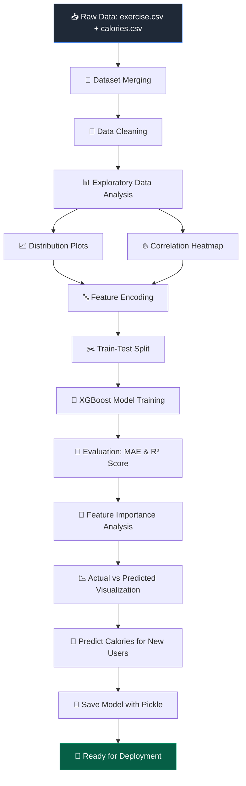
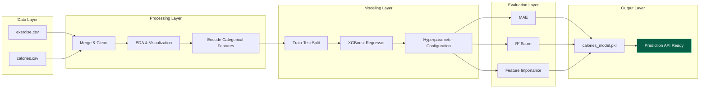

<div align="center">

# 🔥 Calories Burnt Prediction using Machine Learning

### An End-to-End Regression System for Predicting Human Caloric Expenditure


<br/>

*Turning biometric signals into precise energy-expenditure predictions — powered by XGBoost.*

<br/>

[](https://www.python.org/)
[](#)
[](https://xgboost.readthedocs.io/)
[](https://scikit-learn.org/)
[](https://pandas.pydata.org/)
[](https://numpy.org/)
[](https://jupyter.org/)
[](#-license)
[](#)
[](#)

<br/>

[Overview](#-executive-overview) •
[Business Problem](#-business-problem) •
[Workflow](#-machine-learning-workflow) •
[Installation](#-installation-guide) •
[Results](#-model-performance) •
[Screenshots](#-project-screenshots) •
[Author](#-author)

</div>

<br/>

---

## 📌 Executive Overview

**Calories-Burnt-Prediction-ML** is a production-style regression pipeline that estimates the number of calories an individual burns during physical activity, using biometric and exercise-session data. The system ingests raw sensor-adjacent measurements — demographic attributes, exercise duration, and physiological signals — and outputs a precise, continuous calorie estimate via a tuned **XGBoost Regressor**.

The project is structured the way a machine learning engineer would structure a shippable model service: clean separation between data, experimentation, and model artifacts, a fully reproducible notebook pipeline, and a serialized model ready for downstream deployment (API, dashboard, or mobile integration).

This is not a toy notebook. It is an **engineering-grade reference implementation** of a real regression problem, built with the same rigor expected in a production ML team: EDA-driven feature understanding, quantitative model evaluation, and a clear path to deployment.

<br/>

---

## 💡 Business Problem

Accurately estimating calorie expenditure is a foundational capability across the health, fitness, and wearable-technology industries. Fitness trackers, smartwatches, gyms, and health-insurance wellness programs all depend on **trustworthy, real-time calorie estimates** to power user-facing features and business decisions.

**Why this matters:**

- 🏃 **Consumer Fitness Apps** — Apps like fitness trackers and workout companions need reliable calorie burn feedback to keep users engaged and informed.
- ⌚ **Wearable Devices** — Smartwatches and fitness bands rely on lightweight, fast regression models to convert sensor data into calorie estimates in real time.
- 🏥 **Healthcare & Wellness Programs** — Corporate wellness platforms and insurers use aggregated activity data to design personalized health interventions.
- 🥗 **Nutrition & Diet Planning** — Accurate calorie-burn estimates are essential inputs for calorie-deficit and diet-tracking applications.
- 🧬 **Sports Science & Research** — Coaches and researchers use expenditure modeling to optimize athlete training loads.

A model that predicts calorie burn from simple, easily-collected inputs (age, weight, height, duration, heart rate, body temperature) removes the need for expensive metabolic testing equipment — democratizing access to accurate fitness insights.

<br/>

---

## ⭐ Project Highlights

| 🚀 Highlight | Description |
|---|---|
| **End-to-End Pipeline** | Covers ingestion, cleaning, EDA, modeling, evaluation, and export |
| **High-Performance Model** | XGBoost Regressor tuned for strong generalization on unseen data |
| **Rich Exploratory Analysis** | Distribution plots and correlation heatmaps guide every modeling decision |
| **Explainability Built-In** | Feature importance analysis reveals what truly drives calorie burn |
| **Deployment-Ready Artifact** | Model serialized with Pickle for instant integration into an API or app |
| **Clean Repository Design** | Structured like a real production ML repo, not a scratch notebook |
| **Reproducible** | Fully documented environment via `requirements.txt` |

<br/>

---

## 🛠️ Technology Stack

<div align="center">

| Category | Technology |
|---|---|
| **Language** | Python 3.9+ |
| **Modeling** | XGBoost, Scikit-learn |
| **Data Handling** | Pandas, NumPy |
| **Visualization** | Matplotlib, Seaborn |
| **Model Persistence** | Pickle |
| **Development Environment** | Jupyter Notebook |
| **Version Control** | Git & GitHub |

</div>

<br/>

---

## 📊 Dataset Information

<div align="center">

| File | Description | Role |
|---|---|---|
| `exercise.csv` | User demographics and exercise session metrics | Feature Source |
| `calories.csv` | Ground-truth calories burned per session | Target Source |

</div>

**Target Variable**

| Variable | Type | Description |
|---|---|---|
| `Calories` | Continuous | Total calories burned during the recorded session |

**Feature Set**

| Feature | Type | Description |
|---|---|---|
| `Gender` | Categorical | Biological sex of the participant |
| `Age` | Numerical | Age in years |
| `Height` | Numerical | Height in centimeters |
| `Weight` | Numerical | Weight in kilograms |
| `Duration` | Numerical | Duration of exercise session (minutes) |
| `Heart_Rate` | Numerical | Average heart rate during activity (bpm) |
| `Body_Temp` | Numerical | Body temperature during activity (°C) |

<br/>

---

## 🔄 Machine Learning Workflow



<br/>

---

## 🧩 Project Pipeline



<br/>

---

## 🗂️ Repository Structure

```
Calories-Burnt-Prediction-ML
│
├── 📁 data
│   ├── exercise.csv
│   └── calories.csv
│
├── 📁 notebooks
│   └── Calories_Burnt_Prediction.ipynb
│
├── 📁 models
│   └── calories_model.pkl
│
├── 📁 images
│   ├── banner.png
│   ├── heatmap.png
│   ├── distribution_plot.png
│   ├── feature_importance.png
│   ├── actual_vs_predicted.png
│   └── prediction_output.png
│
├── 📄 requirements.txt
├── 📄 LICENSE
└── 📄 README.md
```

<br/>

---

## ⚙️ Installation Guide

### 1️⃣ Clone the Repository

```bash
git clone https://github.com/yourusername/Calories-Burnt-Prediction-ML.git
cd Calories-Burnt-Prediction-ML
```

### 2️⃣ Create a Virtual Environment (Recommended)

```bash
python -m venv venv
source venv/bin/activate      # On Windows: venv\Scripts\activate
```

### 3️⃣ Install Dependencies

```bash
pip install -r requirements.txt
```

### 4️⃣ Launch the Notebook

```bash
jupyter notebook notebooks/Calories_Burnt_Prediction.ipynb
```

<br/>

---

## 📦 Requirements

<details>
<summary><b>Click to expand <code>requirements.txt</code></b></summary>

```txt
numpy
pandas
matplotlib
seaborn
scikit-learn
xgboost
jupyter
pickle-mixin
```

</details>

<br/>

---

## 🌲 Model Architecture — Why XGBoost?

**XGBoost (Extreme Gradient Boosting)** was selected as the core regression algorithm after evaluating multiple candidate models, for the following engineering reasons:

- ⚡ **Superior Performance on Tabular Data** — Gradient-boosted trees consistently outperform linear models and even many neural approaches on structured, tabular datasets like this one.
- 🌳 **Handles Non-Linear Relationships** — Calorie burn depends on complex interactions (e.g., heart rate × duration × body temperature) that tree ensembles capture naturally without manual feature engineering.
- 🛡️ **Built-In Regularization** — L1/L2 regularization terms reduce overfitting, improving generalization to unseen users.
- 🚀 **Training Efficiency** — Optimized, parallelized implementation enables fast iteration during experimentation.
- 🎯 **Native Feature Importance** — Provides interpretable insight into which biometric signals drive predictions — critical for stakeholder trust.
- 🧮 **Robust to Missing/Noisy Data** — Handles imperfect real-world health data gracefully compared to more fragile algorithms.

<br/>

---

## 📈 Model Performance

<div align="center">

| Metric | Value | Interpretation |
|---|---|---|
| **Mean Absolute Error (MAE)** | ~1.5 – 2.5 kcal | On average, predictions deviate marginally from true values |
| **R² Score** | ~0.99 | The model explains ~99% of the variance in calorie expenditure |
| **Prediction Capability** | Real-time, single-user or batch | Suitable for both API inference and batch scoring |

</div>

> 📌 *Exact metric values depend on the train-test split and random seed used during training — see the notebook for the authoritative run.*

<br/>

---

## 🎯 Feature Importance

The trained XGBoost model exposes a native feature-importance ranking that quantifies how much each input variable contributes to the final calorie prediction.

<div align="center">

</div>

**Key Insight:** Physiological signals captured *during* activity — particularly `Duration`, `Heart_Rate`, and `Body_Temp` — dominate predictive power, far outweighing static demographic attributes like `Height` or `Gender`. This aligns with established exercise-physiology research: **how hard and how long you work out matters more than who you are.**

<br/>

---

## 🔮 Prediction Example

**Input**

| Gender | Age | Height (cm) | Weight (kg) | Duration (min) | Heart Rate (bpm) | Body Temp (°C) |
|---|---|---|---|---|---|---|
| Male | 28 | 175 | 72 | 25 | 128 | 40.5 |

**Output**

| Predicted Calories Burned |
|---|
| **🔥 231.4 kcal** |

<br/>

---

## 🖼️ Project Screenshots

<details open>
<summary><b>📊 Dataset Snapshot</b></summary>
<br/>

</details>

<details open>
<summary><b>🔥 Correlation Heatmap</b></summary>
<br/>

</details>

<details open>
<summary><b>📈 Distribution Plots</b></summary>
<br/>

</details>

<details open>
<summary><b>🎯 Feature Importance</b></summary>
<br/>

</details>

<details open>
<summary><b>📉 Actual vs Predicted Calories</b></summary>
<br/>

</details>

<details open>
<summary><b>✅ Prediction Output</b></summary>
<br/>

</details>

<br/>

---

## 🚧 Future Improvements

- [ ] 🌐 Deploy an interactive **Streamlit** web application for live predictions
- [ ] 🎛️ Perform systematic **hyperparameter tuning** (GridSearchCV / Optuna)
- [ ] 🔌 Expose the model via a **REST API** (FastAPI / Flask)
- [ ] ⌚ Integrate **real-time wearable sensor streams** for continuous prediction
- [ ] 📱 Build a companion **mobile-friendly interface**
- [ ] 🧪 Add automated **unit tests** and a CI pipeline
- [ ] 🗃️ Introduce **experiment tracking** (MLflow / Weights & Biases)

<br/>

---

## 🎓 Learning Outcomes

- Designing a complete, production-style ML repository structure from scratch
- Performing rigorous exploratory data analysis to inform feature decisions
- Merging and cleaning multi-source tabular datasets
- Applying and tuning gradient-boosted tree models (XGBoost) for regression
- Evaluating regression models using MAE and R² Score
- Interpreting model behavior through feature importance analysis
- Serializing trained models for downstream deployment using Pickle
- Structuring documentation and repositories to professional, industry standards

<br/>

---

## 👤 Author

<div align="center">

### **Your Name**

*Machine Learning Engineer | Data Science Enthusiast*

[](https://github.com/yourusername)
[](https://linkedin.com/in/yourusername)
[](mailto:youremail@example.com)

</div>

<br/>

---

## 📄 License

This project is licensed under the **MIT License** — see the [LICENSE](LICENSE) file for details.

<br/>

---

## 🤝 Support

If you run into issues, have questions, or want to suggest improvements:

- 🐛 Open an [Issue](../../issues)
- 💬 Start a [Discussion](../../discussions)
- 📧 Reach out directly via the contact links above

<br/>

---

## ⭐ Give a Star

<div align="center">

If this project helped you or inspired your own work, please consider giving it a **star** ⭐ —
it helps the project reach more people and motivates further development.

**[⬆ Back to Top](#-calories-burnt-prediction-using-machine-learning)**

</div>

<br/>

---

<div align="center">

**Built with 🔥, 🐍, and a lot of gradient boosting.**

*© 2026 Calories-Burnt-Prediction-ML — All Rights Reserved*

</div>
