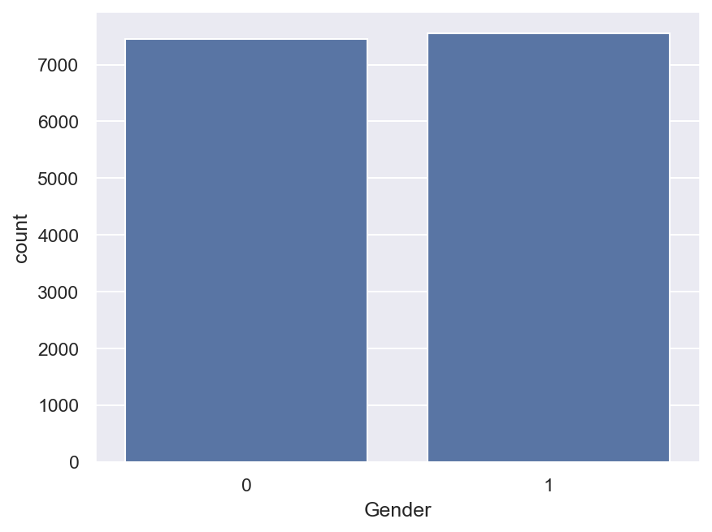

# 🔥 Calories Burnt Prediction

### Predicting Human Caloric Expenditure from Biometric & Activity Data using XGBoost


> **R² Score: 0.998** | **Mean Absolute Error: 1.48 kcal** on held-out test data

---

## 📌 Overview

This project predicts the number of **calories burnt** during exercise based on a person's biometric data (age, gender, height, weight) and activity data (exercise duration, heart rate, body temperature).

The model is built using **XGBoost Regressor**, chosen over Linear Regression and Random Forest for its higher accuracy and ability to capture complex, non-linear relationships in the data.

## 🧠 Why XGBoost?

- Predicts **numerical values** (Calories is a continuous variable) → Regression problem
- Learns complex patterns better than **Linear Regression**, which only works well for simple straight-line relationships
- More optimized and typically more accurate than a standard **Random Forest**, while training faster

## 📂 Dataset

The project combines two datasets:
- `calories.csv` — contains `User_ID` and `Calories` burnt
- `exercise.csv` — contains `User_ID`, `Gender`, `Age`, `Height`, `Weight`, `Duration`, `Heart_Rate`, `Body_Temp`

These are merged into a single dataframe on which analysis and modeling are performed.

## ⚙️ Workflow

1. **Data Collection & Processing** — Load and merge the two CSV files
2. **Data Analysis** — Check shape, info, missing values, and summary statistics
3. **Data Visualization** — Explore distributions of Gender, Age, Height, Weight
4. **Correlation Analysis** — Heatmap to identify relationships between features
5. **Preprocessing** — Encode `Gender` (male → 0, female → 1)
6. **Train/Test Split** — 80/20 split
7. **Model Training** — `XGBRegressor` from the `xgboost` library
8. **Feature Importance** — Identify which features matter most
9. **Evaluation** — MAE and R² Score on test data
10. **Prediction** — Take live user input and predict calories burnt

## 📊 Results

| Metric | Score |
|---|---|
| R² Score | 0.998 |
| Mean Absolute Error | 1.48 kcal |

An R² of 0.998 means the model explains 99.8% of the variation in calories burnt — an excellent fit.

## 🖼️ Visualizations

> **Note:** To make these render on GitHub, save each plot from the notebook as a `.png` into an `images/` folder in your repo (see [Adding the Images](#-adding-the-images) below), then keep these relative paths.

| Visualization | Preview |
|---|---|
| Gender Distribution |  |
| Age Distribution |  |
| Height Distribution (KDE) |  |
| Weight Distribution |  |
| Correlation Heatmap |  |
| Feature Importance |  |
| Actual vs Predicted Calories |  |

### 🔧 Adding the Images

Your current images aren't showing because the paths in the README point to files that don't exist in the repo yet. To fix this:

1. In the notebook, after each plot's `plt.show()`, save it first:
   ```python
   plt.savefig("images/gender_distribution.png", bbox_inches="tight", dpi=150)
   plt.show()
   ```
2. Create an `images/` folder in your repo root and put all 7 `.png` files there.
3. Commit and push:
   ```bash
   git add images/
   git commit -m "Add visualization images"
   git push
   ```
4. Make sure filenames in the README **exactly match** (case-sensitive) the files in `images/`.

## 🚀 Getting Started

### Installation
```bash
pip install numpy pandas matplotlib seaborn scikit-learn xgboost
```

### Usage
```bash
jupyter notebook Calories_Burnt_Prediction.ipynb
```

Run all cells in order. At the end, you can enter your own biometric data to get a live calorie-burn prediction, and the trained model is saved as `calories_model.pkl`.

## 🛠️ Tech Stack

- **Python 3.9+**
- **Pandas / NumPy** — data processing
- **Matplotlib / Seaborn** — visualization
- **Scikit-Learn** — train/test split, evaluation metrics
- **XGBoost** — regression model

## 📁 Project Structure

```
Calories-Burnt-Prediction/
├── Calories_Burnt_Prediction.ipynb
├── calories.csv
├── exercise.csv
├── calories_model.pkl
├── images/
│   ├── gender_distribution.png
│   ├── age_distribution.png
│   ├── height_distribution.png
│   ├── weight_distribution.png
│   ├── correlation_heatmap.png
│   ├── feature_importance.png
│   └── actual_vs_predicted.png
└── README.md
```

## 📄 License

This project is licensed under the **MIT License**.

---

## 👨‍💻 Author

**Shubh Chak**

IT Student | UIET, Panjab University

Aspiring Data Analyst | Python | NumPy | SQL | Power BI

⭐ If you found this project useful, consider giving it a star!

[GitHub](https://github.com/) · [LinkedIn](https://linkedin.com/)
